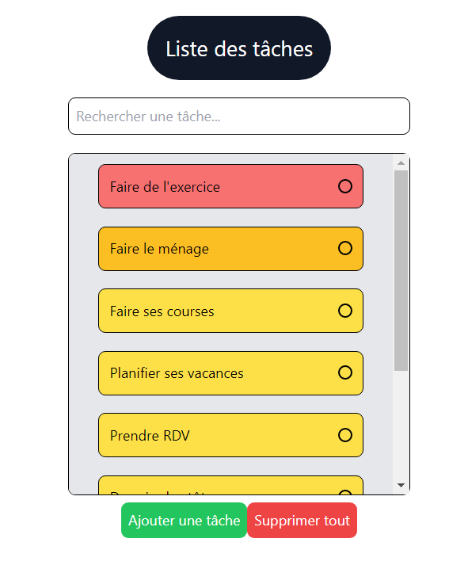

# Todo-list

Le but de ce projet est d'implémenter une liste de tâches en utilisant [React](https://fr.reactjs.org/). Chaque tâche contient un texte d'une taille comprise entre 1 et 50 caractères. Une date et une priorité sont associées avec ainsi il est possible de voir la date d'ajout ou la priorité d'une tâche.

# Lancer l'app

N'oubliez pas d'être dans le répertoire `todo-list`, une fois fait il faut utiliser :

```bash
# installation des modules
npm i
```

```bash
# lancement de l'app
npm start
```

# Aperçu

- Voici un aperçu de l'application : 


